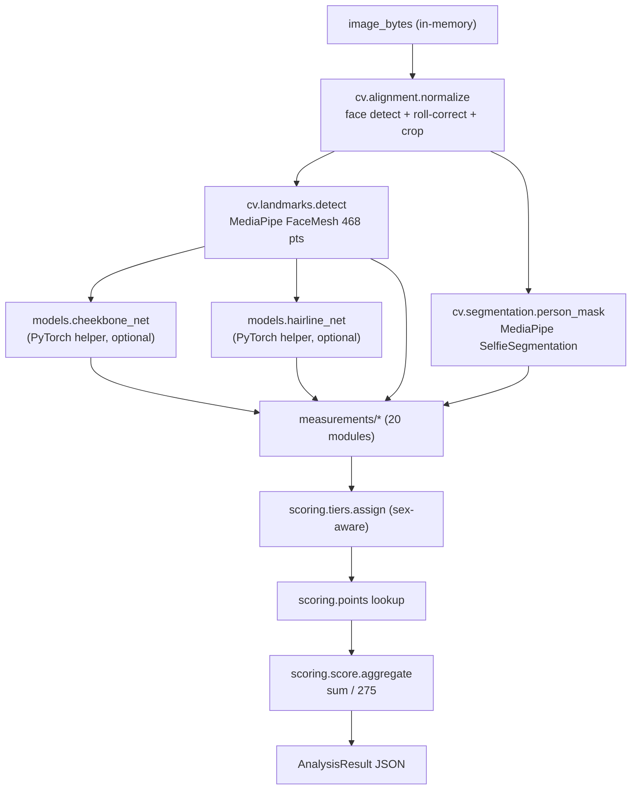

# CV + AI pipeline

End-to-end flow inside `backend/harmony/pipeline.py`:

## Modules

| File                                | Responsibility                                                |
| ----------------------------------- | ------------------------------------------------------------- |
| `cv/alignment.py`                   | Face detect, inter-pupil roll-correction, crop to face bbox.  |
| `cv/landmarks.py`                   | MediaPipe FaceMesh wrapper + named index constants.           |
| `cv/segmentation.py`                | MediaPipe SelfieSegmentation person mask.                     |
| `cv/geometry.py`                    | Euclidean distance, vector angle, signed angle helpers.       |
| `models/cheekbone_net.py`           | Tiny CNN regressing cheekbone-apex y; heuristic fallback.     |
| `models/hairline_net.py`            | Tiny U-Net regressing hairline y; heuristic fallback.         |
| `models/registry.py`                | Lazy loader for `.pt` weights.                                |
| `measurements/<metric>.py`          | One module per scored metric — see list below.                |
| `scoring/tiers.py`                  | Range tables, sex-aware where the spec differs.               |
| `scoring/points.py`                 | Tier → points lookup table.                                   |
| `scoring/score.py`                  | Aggregation: `sum(points) / 275`.                             |
| `pipeline.py`                       | `run(image_bytes, sex)` glue.                                 |
| `cli.py`                            | Terminal entrypoint; same `run()`.                            |

## Metric → landmark mapping (FaceMesh indices)

| Metric                | Inputs                                                                                  |
| --------------------- | --------------------------------------------------------------------------------------- |
| eye_separation_ratio  | Inner canthi `133`, `362`; face width `234`, `454`.                                     |
| facial_thirds         | Hairline y (helper), brow `9`, nose base `2`, chin `152`.                               |
| canthal_tilt          | Per-eye outer `33`/`263` & inner `133`/`362` corners; angle vs horizontal.              |
| fwhr                  | Bizygomatic width `234`↔`454`; upper-face height brow `9` → upper lip `13`.             |
| jaw_frontal_angle     | Gnathion `152`, gonion-L `172`, gonion-R `397`.                                         |
| cheekbone_setness     | Cheekbone apex y (helper); face height (top of face → `152`).                           |
| face_length           | Total face height (top → `152`) / bizygomatic width.                                    |
| bigonial_width        | Bigonial `172`↔`397` / bizygomatic `234`↔`454` × 100%.                                  |
| chin_to_philtrum      | Chin height (lower lip `14` → `152`) / philtrum height (nose base `2` → upper lip `13`). |
| neck_width            | Person mask cross-section at chin + Δ / bigonial width.                                 |
| mouth_to_nose         | Mouth width `61`↔`291` / nose width (alars `49`↔`279`).                                 |
| midface_ratio         | Midface height (brow `9` → nose base `2`) / lower-face height (`2` → `152`).            |
| eyebrow_setedness     | Eye-to-brow vertical distance / eye height.                                             |
| eye_spacing           | Inter-canthal distance / single eye width.                                              |
| eye_aspect_ratio      | Eye width / eye height.                                                                 |
| lower_to_upper_lip    | Lower-lip thickness `14`↔`17` / upper-lip thickness `13`↔`0`.                           |
| iaa_jfa_deviation     | `|IAA − JFA|` (IAA from alar landmarks `49`, `279`).                                    |
| eyebrow_tilt          | Signed angle of eyebrow line (`105`↔`107` / `334`↔`336`) vs horizontal.                 |
| bitemporal_width      | Temple `54`↔`284` / bizygomatic.                                                        |
| lower_third           | `(chin y − upper-lip y)` / total face height × 100%.                                    |

## Ephemerality

`pipeline.run` accepts `bytes` directly; the only on-disk artifacts are the
model weights under `models/weights/`. Image bytes go out of scope when the
function returns.
